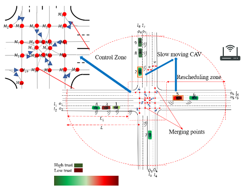

<section>
    <h1 class="title is-3">Publications</h1>
  
    <table width="100%" align="center" border="0" cellspacing="0" cellpadding="15">
        <!-- Publication 1 -->
        <tr>
            <!-- Publication Image -->
            <td style='width:300px;height:150px'>
                
            </td>
            <!-- Publication Details -->
            <td width="67%" valign="top">
                    <b>Reinforcement Learning-based Receding Horizon Control using Adaptive Control Barrier Functions for Safety-Critical Systems</b>
                     Zhili Zhang, H M Sabbir Ahmad, Ehsan Sabouni, Yanchao Sun, Furong Huang, Wenchao Li, Fei Miao Under review (ICRA 2024) 
                

                <!-- Links to Paper, Code, etc. -->
                

                    <a href="https://arxiv.org/abs/2309.11057">[Paper]</a> |
                    <a href="javascript:void(0);" onclick="toggleAbstract('abstract-1')">[Abstract]</a> |
                    <a href="javascript:void(0);" onclick="toggleBibtex('bibtex-1')">[BibTeX]</a> |
                

                <!-- Hidden Abstract and BibTeX sections -->
                

                    
<i>Saty Gauranteed Robust MARL with Hierarchical Control based on CBFs.</i>

                

                <pre id="bibtex-1" style="display:none;">
                    @article{Ahmad_01,
                      title={Safety Guaranteed Robust Multi-Agent Reinforcement Learning with Hierarchical Control for Connected and Automated Vehicles},
                      author={Zhili Zhang, H M Sabbir Ahmad, Ehsan Sabouni, Yanchao Sun, Furong Huang, Wenchao Li, Fei Miao},
                      journal={arXiv preprint arXiv:2309.11057},
                      year={2024}
                    }
                </pre>
            </td>
        </tr>
        <!-- Additional publications... -->
    </table>
    <table width="100%" align="center" border="0" cellspacing="0" cellpadding="15">
        <!-- Publication 1 -->
        <tr>
            <!-- Publication Image -->
            <td style='width:300px;height:150px'>
                
            </td>
            <!-- Publication Details -->
            <td width="67%" valign="top">
                <b>Reinforcement Learning-based Receding Horizon Control using Adaptive Control Barrier Functions for Safety-Critical Systems</b>
                 Ehsan Sabouni, H M Sabbir Ahmad, Vittorio Giammarino, Christos G Cassandras, Ioannis Ch Paschalidis, Wenchao Li IEEE CDC 2024 (to appear) 
                <!-- Links to Paper, Code, etc. -->
                

                    <a href="https://arxiv.org/abs/2403.17338">[Paper]</a> |
                    <a href="javascript:void(0);" onclick="toggleAbstract('abstract-2')">[Abstract]</a> |
                    <a href="javascript:void(0);" onclick="toggleBibtex('bibtex-2')">[BibTeX]</a> |
                    <a href="https://github.com/SabbirAhmad26/CDC2024_RL_adpative_MPC_CBF">[Code]</a> |
                

                <!-- Hidden Abstract and BibTeX sections -->
                

                    
<i>A RL based approach for Safety Gauranteed Control for Autonomous Systems.</i>

                

                <pre id="bibtex-2" style="display:none;">
                    @article{Ahmad_02,
                      title={Reinforcement Learning-based Receding Horizon Control using Adaptive Control Barrier Functions for Safety-Critical Systems},
                      author={Ehsan Sabouni, H M Sabbir Ahmad, Vittorio Giammarino, Christos G Cassandras, Ioannis Ch Paschalidis, Wenchao Li},
                      journal={arXiv preprint arXiv:2403.17338},
                      year={2024}
                    }
                </pre>
            </td>
        </tr>
        <!-- Additional publications... -->
    </table>
    <table width="100%" align="center" border="0" cellspacing="0" cellpadding="15">
        <!-- Publication 1 -->
        <tr>
            <!-- Publication Image -->
            <td style='width:300px;height:150px'>
                
            </td>
            <!-- Publication Details -->
            <td width="67%" valign="top">
              <b>Secure Control of Connected and Automated Vehicles Using Trust-Aware Robust Event-Triggered Control Barrier Functions</b>
               H M Sabbir Ahmad, Ehsan Sabouni, Akua Dickson, Wei Xiao, Christos G. Cassandras, Wenchao Li NDSS VehicleSec 2024 
                <!-- Links to Paper, Code, etc. -->
                

                    <a href="https://arxiv.org/abs/2401.02306">[Paper]</a> |
                    <a href="javascript:void(0);" onclick="toggleAbstract('abstract-3')">[Abstract]</a> |
                    <a href="javascript:void(0);" onclick="toggleBibtex('bibtex-3')">[BibTeX]</a> |
                    <a href="https://github.com/SabbirAhmad26/Trust_based_CBF">[Code]</a> |
                

                <!-- Hidden Abstract and BibTeX sections -->
                

                    
<i>Trust Aware Secure and Safe Control using Control Barrier Functions.</i>

                

                <pre id="bibtex-3" style="display:none;">
                    @article{Ahmad_03,
                      title={Secure Control of Connected and Automated Vehicles Using Trust-Aware Robust Event-Triggered Control Barrier Functions},
                      author={H M Sabbir Ahmad, Ehsan Sabouni, Akua Dickson, Wei Xiao, Christos G. Cassandras, Wenchao Li},
                      journal={Symposium on Vehicles Security and Privacy (VehicleSec)},
                      year={2024}
                    }
                </pre>
            </td>
        </tr>
        <!-- Additional publications... -->
    </table>
    <table width="100%" align="center" border="0" cellspacing="0" cellpadding="15">
        <!-- Publication 1 -->
        <tr>
            <!-- Publication Image -->
            <td style='width:300px;height:150px'>
                
            </td>
            <!-- Publication Details -->
            <td width="67%" valign="top">
                <b>Trust-Aware Resilient Control and Coordination of Connected and Automated Vehicles</b>
                 H M Sabbir Ahmad, Ehsan Sabouni, Wei Xiao, Christos G. Cassandras, Wenchao Li IEEE ITSC 2023 
                <!-- Links to Paper, Code, etc. -->
                

                    <a href="https://ieeexplore.ieee.org/abstract/document/10421858">[Paper]</a> |
                    <a href="javascript:void(0);" onclick="toggleAbstract('abstract-4')">[Abstract]</a> |
                    <a href="javascript:void(0);" onclick="toggleBibtex('bibtex-4')">[BibTeX]</a> |
                

                <!-- Hidden Abstract and BibTeX sections -->
                

                    
<i>Trust Aware Control and Coordination using Control Barrier Functions.</i>

                

                <pre id="bibtex-4" style="display:none;">
                    @article{Ahmad_04,
                      title={Trust-Aware Resilient Control and Coordination of Connected and Automated Vehicles},
                      author={H M Sabbir Ahmad, Ehsan Sabouni, Wei Xiao, Christos G. Cassandras, Wenchao Li},
                      journal={IEE International Conference on Intelligent Transportation Systems},
                      year={2023}
                    }
                </pre>
            </td>
        </tr>
        <!-- Additional publications... -->
    </table>
  <table width="100%" align="center" border="0" cellspacing="0" cellpadding="15">
        <!-- Publication 1 -->
        <tr>
            <!-- Publication Image -->
            <td style='width:300px;height:150px'>
                
            </td>
            <!-- Publication Details -->
            <td width="67%" valign="top">
                <b>Optimal control of connected automated vehicles with event-triggered control barrier functions: a test bed for safe optimal merging</b>
                 Ehsan Sabouni, H M Sabbir Ahmad, Wei Xiao, Christos G. Cassandras, Wenchao Li 2023 IEEE Conference on Control Technology and Applications (CCTA) 
                <!-- Links to Paper, Code, etc. -->
              

                  <a href="https://ieeexplore.ieee.org/document/10253379">[Paper]</a> |
                  <a href="javascript:void(0);" onclick="toggleAbstract('abstract-5')">[Abstract]</a> |
                  <a href="javascript:void(0);" onclick="toggleBibtex('bibtex-5')">[BibTeX]</a> |
              

              <!-- Hidden Abstract and BibTeX sections -->
              

                  
<i>A Testbed for Event-Triggered Control using Control Barrier Functions.</i>

              

              <pre id="bibtex-5" style="display:none;">
                  @article{Ahmad_05,
                    title={Optimal control of connected automated vehicles with event-triggered control barrier functions: a test bed for safe optimal merging},
                    author={Ehsan Sabouni, H M Sabbir Ahmad, Wei Xiao, Christos G Cassandras, Wenchao Li},
                    journal={IEEE Conference on Control Technology and Applications (CCTA)},
                    year={2023}
                  }
              </pre>
            </td>
        </tr>
        <!-- Additional publications... -->
    </table>
  <table style='border-width:0px;border-color:rgb(255,255,255);border-collapse:collapse' cellspacing='0' bordercolor='#888' border='1'>
        <!-- Publication 1 -->
        <tr>
            <!-- Publication Image -->
            <td style='width:300px;height:150px'>
                
            </td>
            <!-- Publication Details -->
            <td width="67%" valign="top">
              <b>Evaluations of cyber attacks on cooperative control of connected and autonomous vehicles at bottleneck points</b>
                H M Sabbir Ahmad, Wei Xiao, Christos G Cassandras, Wenchao Li  2023 IEEE Conference on Control Technology and Applications (CCTA)  
              <!-- Links to Paper, Code, etc. -->
              

                  <a href="https://par.nsf.gov/servlets/purl/10420904">[Paper]</a> |
                  <a href="javascript:void(0);" onclick="toggleAbstract('abstract-6')">[Abstract]</a> |
                  <a href="javascript:void(0);" onclick="toggleBibtex('bibtex-6')">[BibTeX]</a> |
              

              <!-- Hidden Abstract and BibTeX sections -->
              

                  
<i>Evaluations of Cyber-attacks on Connected and Automated Vehicles.</i>

              

              <pre id="bibtex-6" style="display:none;">
                  @article{Ahmad_06,
                    title={Evaluations of cyber attacks on cooperative control of connected and autonomous vehicles at bottleneck points},
                    author={H M Sabbir Ahmad, Ehsan Sabouni, Wei Xiao, Christos G Cassandras, Wenchao Li},
                    journal={Symposium on Vehicles Security and Privacy (VehicleSec)},
                    year={2023}
                  }
              </pre>
            </td>
        </tr>
        <!-- Additional publications... -->
    </table>
</section>
## Conference papers
* **Reinforcement Learning-based Receding Horizon Control using Adaptive Control Barrier Functions for Safety-Critical Systems**[<a href="https://arxiv.org/abs/2403.17338" target="_blank">PDF</a>],
  Ehsan Sabouni, H M Sabbir Ahmad, Vittorio Giammarino, Christos G. Cassandras, Ioannis Ch. Paschalidis, Wenchao Li
  Accepted as a paper at **CDC 2024**
* **Secure Control of Connected and Automated Vehicles Using Trust-Aware Robust Event-Triggered Control Barrier Functions** [<a href="https://www.ndss-symposium.org/wp-content/uploads/vehiclesec2024-37-paper.pdf" target="_blank">PDF</a>],
  H M Sabbir Ahmad, Ehsan Sabouni, Akua Dickson, Wei Xiao, Christos G Cassandras, Wenchao Li
**(NDSS) VehicleSec Symposium 2024**
* **Trust-Aware Resilient Control and Coordination of Connected and Automated Vehicles** [<a href="https://ieeexplore.ieee.org/stamp/stamp.jsp?tp=&arnumber=10421858" target="_blank">PDF</a>],
   H M Sabbir Ahmad, Ehsan Sabouni, Wei Xiao, Christos G Cassandras, Wenchao Li
   Accepted as a paper at **26th IEEE International Conference on Intelligent Transportation Systems ITSC 2023**.
* **Merging control in mixed traffic with safety guarantees: a safe sequencing policy with optimal motion control** [<a href="https://ieeexplore.ieee.org/stamp/stamp.jsp?tp=&arnumber=10422265" target="_blank">PDF</a>],
  Ehsan Sabouni, H M Sabbir Ahmad, Christos G Cassandras, Wenchao Li
    Accepted as a paper at **26th IEEE International Conference on Intelligent Transportation Systems ITSC 2023**.
* **Optimal Control of Connected Automated Vehicles with Event-Triggered Control Barrier Functions: a Test Bed for Safe Optimal Merging** [<a href="https://ieeexplore.ieee.org/abstract/document/10253379" target="_blank">PDF</a>],
    E Sabouni, H M Sabbir Ahmad, W Xiao, CG Cassandras, W Li
    Accepted as a paper at **7th IEEE Conference on Control Technology and Applications (CCTA) 2023**.
* **Evaluations of Cyberattacks on Cooperative Control of Connected and Autonomous Vehicles at Bottleneck Points** [<a href="https://www.ndss-symposium.org/wp-content/uploads/2023/02/vehiclesec2023-23082-paper.pdf" target="_blank">PDF</a>]
    H M Sabbir Ahmad, E Sabouni, W Xiao, CG Cassandras, W Li
    **(NDSS) VehicleSec Symposium 2023**
* **Energy Efficient Real time Outdoor Air Quality Monitoring System** [<a href="https://ieeexplore.ieee.org/abstract/document/9148229" target="_blank">PDF</a>],
    Abderrazak Abdaoui, H. M. Sabbir Ahmad, Hasan Tariq, Farid Touati, Adel Ben Mnaouer, Mohammed Al-Hitmi,
    **International Wireless Communications and Mobile Computing (IWCMC), Limassol, Cyprus, 2020, pp. 2170-2176**.
* **Cyber Attack Detection for a Nonlinear Binary Crude Oil Distillation Column** [<a href="https://ieeexplore.ieee.org/document/9089577" target="_blank">PDF</a>],
  H M Sabbir Ahmad, Nader Meskin,
  **IEEE International Conference on Informatics, IoT, and Enabling Technologies (ICIoT)**. 
* **Voltage control in distribution networks using current source converter STATCOM based on state feedback controller and Kalman filter** [<a href="https://ieeexplore.ieee.org/abstract/document/8372544/" target="_blank">PDF</a>],
  H M Sabbir Ahmad, Ahmed Massoud, Nader Meskin,
  **IEEE 12th International Conference on Compatibility, Power Electronics and Power Engineering (CPE-POWERENG 2018)**. 
  
## Journal articles
* **A Smart Rig for Calibration of Gas Sensor Nodes** [<a href="https://www.mdpi.com/1424-8220/20/8/2341" target="top">PDF</a>],
    Mohieddine Benammar, Abderrazak Abdaoui, Sabbir HM Ahmad, Farid Touati, Abdullah Kadri,
    **MDPI Sensors, Vol. 8, Issue 8, 2020**.
* **A modular IoT platform for real-time indoor air quality monitoring** [<a href="https://www.mdpi.com/1424-8220/20/8/2341" target="top">PDF</a>],
    Mohieddine Benammar, Abderrazak Abdaoui, Sabbir HM Ahmad, Farid Touati, Abdullah Kadri,
    **MDPI Sensors, Vol. 18, Issue 2, 2018**.
* **Real-Time Indoor Air Quality Monitoring Through Wireless Sensor Network** [<a href="https://www.iaras.org/iaras/filedownloads/ijitws/2017/022-0002(2017).pdf" target="top">PDF</a>],
  ,
    H M Sabbir Ahmad, Mohammad Meraj, Atif Iqbal, Nader Meskin,
    **International Journal of Internet of Things and Web Services, Vol. 2, pp. 7-13, 2017**. 

## Book chapters
* **Cyber-Attack Detection for a Crude Oil Distillation Column** [<a href="https://link.springer.com/chapter/10.1007/978-3-030-97166-3_13" target="top">Book link</a>],
    H M Sabbir Ahmad, Mohammad Noorizadeh, Nader Meskin,
    **Security and Resilience in Cyber-Physical Systems, pp 323–346, 2022.** 
* **Rotor Flux-Oriented Control of Three-Phase Induction Motor Using Sliding Mode Controller and Rotor Flux Estimator** [<a href="https://link.springer.com/chapter/10.1007/978-981-33-4080-0_14" target="top">Book link</a>],
  ,
    H M Sabbir Ahmad, Mohammad Meraj, Atif Iqbal, Nader Meskin,
    **Renewable Power for Sustainable Growth pp 143–154, 2021**.
   

